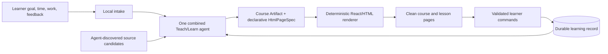
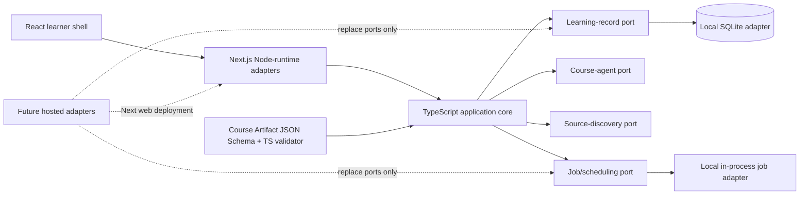
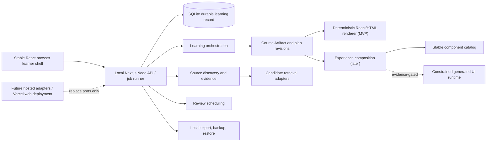

# Solution Document

Status: Accepted

Accepted: 2026-07-26

Based on: [accepted Requirements Document](Requirements.md) (accepted at `50252064f91b500efd30bb95cc8ac14724bdf279`) and [accepted Discovery Document](Discovery.md) (accepted at `50b86de2c174af4e0ace7866b42e96e9d72535bb`)

This accepted revision supersedes the prior Solution. It responds to PR #36's stack feedback and is the downstream basis for revised execution planning.

## Recommendation

Use a **TypeScript-first, full-stack Next.js application**: React/Next renders the local learner website and Node-runtime server code hosts the local application boundary. Run it locally as one Node process (`next dev` for development; `next build` plus `next start` for the supported local run). Keep the Course Artifact, learner commands, validation, learning orchestration, and repository interfaces in framework-independent TypeScript packages; Next route handlers/server actions are thin adapters, not the domain model.

This provides the cohesive frontend/backend experience the product owner wants and preserves a credible later Vercel deployment path. It does **not** make Vercel the V1 runtime: V1 remains a local, persistent Node process with a local SQLite adapter. Future hosted operation keeps the Next application but replaces the local SQLite and in-process job adapters with hosted durable-record and worker/queue adapters. Vercel Functions are bounded request runtimes, not a durable database or general job system; their time limits and ephemeral/multi-instance behavior make them unsuitable as the sole authoritative learning-record or orchestration runtime.

Preserve the target local-first architecture, but earn it in this order: first put one useful Teach/Learn-style backend agent, a durable Course Artifact, and clean declarative course and lesson pages in front of the learner. The initially combined agent may plan the course and its presentation. The local application owns every state transition.

Use early learning records and learner feedback only for bounded next-lesson, pacing, or plan changes. Next earn continuity, practical activities and SRS, and stable component selection/reuse. Defer mature capability-evidence adaptation and algorithmic source qualification/ranking/selection/reuse until those core experiences work together. The richer constrained executable generated-component runtime remains a later, evidence-gated Wayfinder, distinct from the early declarative-page path.

## Approaches considered

| Approach | Result | Decisive trade-off |
| --- | --- | --- |
| TypeScript, Next.js, local Node runtime and SQLite; later deploy the web adapter to Vercel and replace local infrastructure ports | **Recommended** | One language, shared contracts, UI types, validation, and test tooling now; retains local durable state while keeping a direct Next/Vercel web path later. |
| React/Next frontend with a separate Python application API | Viable, not recommended | Python is capable of agent orchestration, but introduces a second contract/tooling/runtime boundary before V1 proves a need. It weakens the requested cohesive Vercel/TypeScript development path. |
| Deploy a Next/Vercel Functions application as V1's authoritative backend | Not viable | Violates the local-first durable-record requirement and would couple SQLite persistence and agent/job lifecycle to bounded, ephemeral serverless requests. |
| Browser-only storage, Streamlit, or chat-first prototype | Not viable | Fails the purpose-built learner UI, authoritative durable/auditable record, and credible growth-path guardrail. |
| Trusted-shell execution of generated code or arbitrary agent/tool writes | Not viable | Violates the constrained-UI trust boundary and removes reliable audit, revocation, and application-owned state transitions. |

## Initial deep seam and MVP

`CourseArtifact` is the first stable application contract: an immutable, versioned description of a course or journey revision. It includes learner goal and time, ordered lessons, source-evidence references or recorded gaps, read-ahead/daily views, and a declarative `HtmlPageSpec` for clean, simple course and lesson pages. It is data, not executable browser code, and grants neither an agent nor a page direct write authority.

The public contract is versioned JSON Schema plus TypeScript types and a single TypeScript validator. `Renderer.render(courseArtifact, learnerState)` deterministically turns that contract into React/HTML in the local website. It owns navigation, accessible layout, input validation, and translation of learner actions to application commands. The application validates and persists commands, feedback, work, artifact lineage, source candidates/uses/gaps, and the earliest bounded adaptation rationale.

The MVP is successful when a learner can give intake, receive a source-grounded course and clean lesson pages, give feedback or complete work, and reopen the local site with that record intact. It records source candidates, use, coverage, provenance available at use, and evidence gaps before material instructional claims. It has no approved-source list, human source curation, or H1 source-use approval. Course planning and UI generation stay combined until observed variation makes a split useful.

### Teach-skill mapping

Matt Pocock's Teach skill is an explicit MVP inspiration, not a runtime dependency. Its inputs map naturally to the product record: `MISSION.md` becomes journey goal/context; `RESOURCES.md` maps to SourceCandidate/Use/Gap; learning records and notes map to learner state/preferences; a lesson HTML file maps to a declarative lesson `HtmlPageSpec`; shared assets inform the later stable-component catalog. Its zone-of-proximal-development selection, short interactive lessons, immediate feedback, retrieval/spacing, and resource-first workflow inform the combined agent's prompt and policy.

The product deliberately does not adopt its workspace files as application storage, permit agents to write arbitrary assets, or render generated lesson HTML unsafely. The agent produces a validated artifact, then the deterministic renderer produces the page.

## Runtime and package boundaries

| Boundary | Responsibility and initial rule |
| --- | --- |
| `packages/contracts` | Course Artifact and learner-command JSON Schemas, inferred/declared TypeScript types, and validation. It has no Next, SQLite, model, or browser dependency. |
| `packages/core` | Application commands and use cases: create/revise course, render view model, record work/feedback, and bounded next-step revisions. It depends on ports, never on Next route handlers. |
| Local Next application | React views plus Node-runtime route/server adapters. It validates input, calls core, and returns view models or streamed agent progress. It is the only V1 browser/server boundary. |
| Local infrastructure adapters | SQLite is the authoritative write owner; source/model retrieval, filesystem backup/export, and in-process jobs are explicit adapters. Browser caches are rebuildable. |
| Future hosted adapters | A later deployment selects a durable hosted database, queue/worker, identity, secrets, and observability implementation. Vercel can host the Next web/BFF adapter, but it is not assumed to own long-running workers or durable state. |

Use Node runtime for all V1 server paths that need SQLite, filesystem operations, or Node packages; do not use the Edge runtime for those paths. Keep long agent work behind a job port even if the first local adapter runs it synchronously or in-process. This avoids a future web-hosting choice leaking into the learning domain.

The current Python-only I01 contract implementation should **not merge unchanged**. Its schema, fixture, and contract intent remain useful, but I01 should land as the TypeScript contract/validator and a standard TypeScript test runner before it unlocks downstream TypeScript work.

## Evolutionary delivery path

Each stage preserves the Course Artifact and durable-record lineage. The stages order delivery; they do not relax the accepted V1 outcomes that must be present by the final demonstrations.

| Stage | Evidence gate and purpose | Add | Keep deferred |
| --- | --- | --- | --- |
| 0. HTML learning loop | Establish that the combined agent and simple purpose-built pages create a useful local course. | Next/TypeScript local app; intake; agent-driven candidate discovery and source/gap capture; Course Artifact with `HtmlPageSpec`; deterministic React/HTML rendering; work/feedback records; bounded feedback-driven next-step or plan revision. | Separate planning/UI agents, recovery tooling beyond MVP persistence, activities/SRS, stable catalog, mature capability model, algorithmic source ranking/reuse, executable generated UI. |
| 1. Continuity | A second session, revision, or recovery proves history matters. | Journey identity; immutable course/plan revisions; preferences, outcomes and provenance context; backup/restore and local status. | Hosted or multi-user identity/operations. |
| 2. Practical learning and reusable stable components | Continuity and learner feedback show a need for richer practice and retention. | Practical activities; Review Items with deterministic SRS; stable component selection, arrangement, usage, and reuse; catalog gaps. | Executable generated components merely to avoid a normal component; mature source policy and adaptation engine. |
| 3. Mature evidence-driven adaptation and source policy | Core HTML/catalog, continuity, activity, and review experiences work together and yield enough observed signals. | Capability Evidence and explainable Adaptation Decisions; policy-versioned algorithmic qualification, ranking, selection, and reuse using available quality, trust, relevance, coverage, provenance, permitted-use, prior-use, and outcome signals; weak/poor-source observability. | Human source approval, curated trusted-corpus dependence, or claims of final/truthful ranking. |
| 4. Productization and source improvement | Repeated component and source patterns justify deliberate operationalization. | Productization inbox; separately reviewed Supported Module releases; outcome-informed source-policy improvements. | Automatic promotion or a human gate for ordinary source use. |
| 5. Generated-component runtime Wayfinder | A documented subject/activity need remains unmet by clean HTML and the stable catalog, after Stage 2 or later. | Only if H1 opens the gate: immutable Generated Module Package, validator, opaque-origin iframe/CSP runtime, finite host protocol, denial audit, fallback, and revocation. | Ambient network, storage, host DOM, server, tool, secret, or product-data access; arbitrary dynamic tools. |

The final V1 demonstrations still cover Malay and an additional viable subject, persistent review, evidence-driven adaptation, audited source decisions, and a generated-UI case. Stage 5 is the controlled route to that case; it is not an MVP page-generation mechanism.

## Target application architecture

The browser shell, application API/job runner, and SQLite record run in one loopback-local Node process. The local adapter supplies one owner, while `LearnerId` remains in commands and records for a later identity/tenancy port. SQLite is the authoritative write owner; browser and generated-package caches are rebuildable.

### Application seams

| Seam | Responsibility and contract | Initial boundary |
| --- | --- | --- |
| Course Artifact & HTML Renderer | `createRevision`, `getArtifact`, `render`, `submitAction`; declarative `HtmlPageSpec` produces accessible, clean pages. | Versioned JSON Schema, TypeScript contract/validator, React view model; no executable generated UI. |
| Journey & Learning Record | Validates `recordWork`, `recordCheckIn`, `revisePlan`, and stores early feedback adaptation before later deriving mature capability evidence. | Transactional SQLite repositories; agents/pages never write directly. |
| Source Discovery & Evidence | Agents discover and record candidates, use, coverage, provenance available at use, and gaps; Stage 3 adds `qualify`, `rank`, and `selectOrReuse`. | Retrieval adapters and inspectable record lineage; no curated-trust snapshot or human approval gate. |
| Experience Composition | Uses simple declarative pages first; Stage 2 resolves stable components and records catalog gaps before any runtime request. | Typed presentation intent and layout specification. |
| Generated Module Runtime | Stage 5 validates, renders, dispatches finite UI capabilities, tears down, and revokes immutable packages. | Browser sandbox adapter; absent from the MVP path. |
| Review Scheduling | `recordReview`, `dueFor`, `reschedule`; applies a configured deterministic spacing policy. | Stage 2 port. |
| Local Operations | `backup`, `exportBundle`, `restore`, `appendAudit`, `health`. | Filesystem plus SQLite; future services replace ports. |

### Source and adaptation evolution

The MVP agent discovers sources before teaching claims and records candidates, available provenance/permitted-use context, coverage, use, and gaps. This is sufficient to ground early pages and make missing evidence visible; it is not a mature source-quality or reuse algorithm.

After the Stage 3 gate, `SourceRecord`, `SourceQualification`, `SourceSelection`, and `SourceGap` carry versioned policy inputs/rationale for algorithmic qualification, ranking, selection, and reuse. The policy uses the accepted signals and preserves outcome feedback, including an observable weak or poor source. No H1-curated corpus or H1 approval is introduced. Likewise, early feedback-driven changes remain explicitly bounded until capability evidence and explainable Adaptation Decisions can support changes to plan, pacing, difficulty, review, teaching style, and source-selection/reuse feedback.

### Generated UI target and trust boundary

Early generated UI is declarative `HtmlPageSpec` data rendered by trusted React components. It cannot introduce raw scripts, arbitrary attributes, network access, or direct state writes. This supplies immediate, clean generated pages without treating generated HTML/JavaScript as trusted code.

If the Stage 5 Wayfinder is opened, a `GeneratedModulePackage` is an immutable content-addressed source bundle with a manifest, bounded input/output schemas, declared finite capability set, generator/run/input provenance, validation result, usage/outcome links, and predecessor. The validator verifies hash/contract linkage, capability allowlist, schema bounds, prohibited remote-resource scan, fixture/readiness tests, and layout/style/accessibility checks before first render.

The runtime uses a fresh `sandbox="allow-scripts"` iframe without allow-same-origin, forms, popups, downloads, or navigation permissions and a deny-by-default CSP (`default-src 'none'`; `connect-src 'none'`). A nonce-bound, versioned `MessageChannel` is the only host communication. The host validates the package, session/activity binding, schemas, event/payload limits, and every request. The initial protocol is limited to `activity.submit`, bounded transient `activity.draft`, allowlisted `telemetry.emit`, clamped `layout.requestResize`, and `ui.reportError`; unknown or invalid requests are denied and audited.

The package receives no network, cookies/storage, host DOM, product record, application API, server, tool, secret, or general learner-data authority. Failed validation or incidents tear it down, retain evidence, and use a stable fallback. Revocation disables its hash; promotion remains a separately reviewed Supported Module release.

## Testing and operations

Use the ordinary TypeScript stack rather than bespoke test machinery: a TypeScript compiler check, a standard TypeScript unit-test runner (Vitest), contract fixtures validated through the public contract package, and React rendering/integration tests as surfaces arrive. GitHub Actions runs the code test and typecheck commands for pull requests; agent/evaluation experiments remain separately runnable evidence, not CI substitutes.

Every application write appends or transactionally associates an audit event. MVP records are Journey, CourseArtifact, HtmlPageSpec/ArtifactLineage, LearningActivity, learner feedback, SourceRecord, SourceUse, and SourceGap. Continuity and Stage 2 add plan revisions, preferences, ReviewItem, component selection/reuse, and recovery evidence. Stage 3 adds CapabilityEvidence, AdaptationDecision, SourceQualification, and SourceSelection. Stage 5 adds GeneratedModulePackage, PackageValidationResult, GeneratedModuleUse, and PackageRevocation.

Local operations document setup, migration, backup, export, restore, health/status, and recovery as the relevant stages arrive. Exports include only artifacts that may be retained/exported under their terms and redact learner responses by default. Before public release, H1 must select a license; contributor/governance materials, dependency/generated-artifact notices, data exclusions, and a private vulnerability-reporting route must be documented. This is a release gate, not an MVP architecture blocker.

## Risks, constraints, and Wayfinder candidates

| Item | Current treatment / next decision |
| --- | --- |
| Local SQLite library/package choice | Select a maintained Node SQLite adapter when implementing the local record port; its concrete native/WASM trade-off is an implementation decision, but it must support the local supported runtime and transactional writes. |
| Future Vercel deployment | Validate the Next web adapter there later; select hosted durable database and worker/queue before making Vercel a production backend. Do not infer that a local SQLite file deploys to Vercel. |
| Early HTML pages may be insufficient or inconsistent | Demonstrate their usefulness before adding abstraction; use declarative schemas, accessible rendering, and feedback evidence rather than executable page code. |
| Early adaptation could be mistaken for mature effectiveness | Label it bounded feedback/work-driven revision; defer broad calibration claims and the mature evidence engine to Stage 3. |
| Premature source policy can amplify poor evidence | Keep early discovery/use/gaps auditable; introduce qualification/ranking/reuse only after core experience evidence, with policy versions and a weak/poor-source case. |
| Generated runtime expands attack surface | It is a later Wayfinder only after an evidenced HTML/catalog gap; any richer privilege requires a human-owned security decision. |
| Productization criteria | Surface repeated usefulness and failures; H1 decides promotion criteria and releases without becoming a source-use gate. |
| Future hosted/multi-user mode | Before promotion beyond local V1, decide identity/roles, privacy, retention/consent, tenancy, secrets, server isolation, monitoring, operations, and migration. |
| Open-source license | Human-owned choice before public release; no license is selected here. |

## Architecture decisions recorded

- [ADR 0001: local application process and SQLite record](../adr/0001-local-application-process-and-sqlite.md) — update to TypeScript/Next implementation when the Solution is accepted.
- [ADR 0002: evidence-gated generated module runtime and productization boundary](../adr/0002-catalog-candidate-and-productization-boundaries.md)
- [ADR 0003: application-owned state and provenance](../adr/0003-application-owned-state-and-provenance.md)
- [ADR 0004: Course Artifact to Renderer evolutionary seam](../adr/0004-course-artifact-renderer-evolutionary-seam.md)

## Human decision

Accepted by Luke Lemke on 2026-07-26. OpenBook V1 uses a TypeScript-first Next.js application with a local Node/SQLite runtime, while preserving Next/Vercel as a later web-deployment path through explicit persistence and job ports. The Python I01 contract must be converted to that stack before merge; the target architecture and evolutionary delivery order otherwise remain unchanged.
