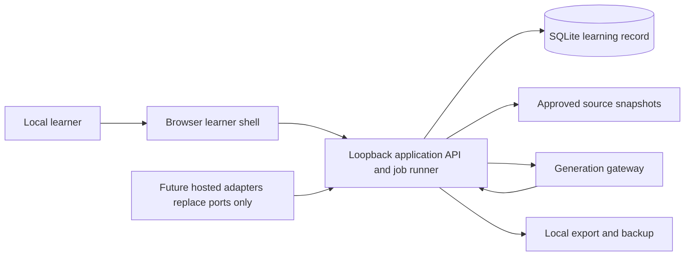
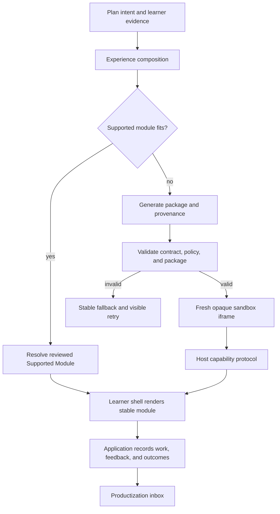
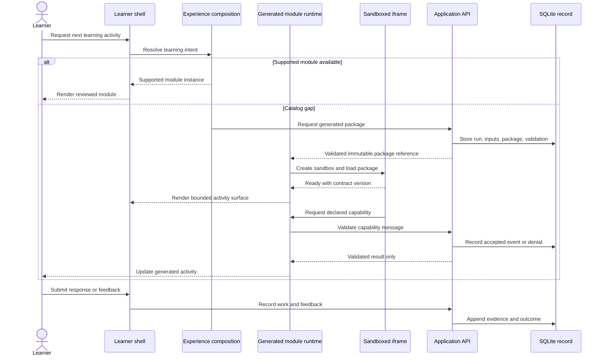

# Solution Document

Status: Proposed

Based on: [accepted Requirements Document](Requirements.md) (accepted at `9f7edc8cab8442f8d3512270d429f974cc40419a`) and [accepted Discovery Document](Discovery.md) (accepted at `50b86de2c174af4e0ace7866b42e96e9d72535bb`)

## Recommendation

Build V1 as a loopback-local web application: a stable browser learner shell, an application API/job runner, and a SQLite learning record. The shell composes reviewed **Supported Modules** for ordinary work and can immediately render a newly generated **Generated Module Package** when the catalog cannot meet a stated learning intent.

A Generated Module Package is executable client-side UI code, not merely a declarative candidate. It runs only in a fresh opaque-origin sandboxed iframe with a deny-by-default CSP and receives no ambient host, server, tool, secret, network, storage, or product-record authority. It can affect learning only through a small, versioned host capability protocol that validates every message. This preserves immediate, subject-appropriate rendering while keeping state changes, source access, and privilege with the application.

The package, its source/code, hashes, prompt/input references, generator run, validation evidence, approved capability manifest, uses, outcomes, and learner feedback are immutable records. Repeatedly useful packages appear in a productization inbox; only a human Productization Decision and a separately reviewed Supported Module release make a capability trusted catalog behavior.

## Context and containers

The V1 process binds to loopback by default. `LearnerId` remains in every command and record even though the local adapter supplies one owner, preserving the future identity/tenancy seam without delivering authentication or multi-user operation.

## Decisive choices

| Decision | Alternatives considered | Choice and rationale |
| --- | --- | --- |
| Generated UI form | Declarative candidates only; unrestricted agent JavaScript in the shell; constrained sandboxed client package | Choose constrained sandboxed client packages. Declarative-only cannot meet the immediate fresh-component requirement; shell execution would expose product state and browser privileges. |
| Isolation | Same-origin iframe; opaque-origin sandboxed iframe; remote code-execution service | Choose one fresh opaque-origin iframe per generated instance. It supports immediate browser rendering locally while separating DOM, storage, origin, and network from the shell. A remote executor adds out-of-scope hosting and still needs a browser boundary. |
| Trust authority | Agent writes state or calls tools; host-validated capability protocol | Choose host-owned commands. The package gets only declared UI capabilities, never ambient application authority. |
| Reuse lifecycle | Automatic promotion; retain nothing; evidence-led human productization | Choose immutable retention plus a human productization inbox. Outcome signals make patterns visible but cannot make them trusted. |
| Persistence/runtime | Browser-only storage; SQLite behind ports; hosted service | Choose SQLite behind repository and job ports. It provides one durable local write owner and a credible later database replacement. |

## Rendering flow and constrained trust boundary

The sequence intentionally uses conservative Mermaid syntax: simple aliases, `alt`/`else`/`end`, and no unsupported notes or HTML labels.

### Generated Module Contract v1

The package is an immutable content-addressed bundle containing:

- `manifest`: package ID/version/hash, declared learning purpose, layout slot, style tokens used, accessibility claims, bounded input/output schemas, and requested capability names;
- `ui.js` and `ui.css`: browser code and styles that render only inside its iframe; no imports, remote URLs, or dynamic module loading;
- `fixtures` and contract tests: bounded test inputs, expected emitted events, and a render/readiness timeout;
- provenance: generator identity/configuration, generation-run ID, prompt/input artifact references and hashes, approved-source snapshots, predecessor package if any, and validation report.

The shell gives the iframe an exact page-layout slot and design-token stylesheet. The contract requires responsive rendering within that slot, semantic labels and keyboard operation for interactive controls, declared completion/error states, and events conforming to the declared schemas. The shell owns page navigation, learner-visible identity/progress, cross-activity layout, and all persistent state; a package cannot alter them.

### Runtime enforcement

`GeneratedModuleRuntime.render(packageRef, slot, scopedInput)` creates an iframe with `sandbox="allow-scripts"` and no `allow-same-origin`, `allow-forms`, `allow-popups`, `allow-modals`, `allow-downloads`, or top-navigation flags. It injects a CSP equivalent to:

`default-src 'none'; connect-src 'none'; img-src data: blob:; media-src data: blob:; font-src data:; style-src 'unsafe-inline'; script-src 'unsafe-inline'; base-uri 'none'; form-action 'none'; frame-ancestors 'none'`.

The generated document has no host DOM reference, same-origin storage, cookies, service-worker authority, network connection, application API credential, secret, tool handle, or direct database access. The host does not pass a general learner record: `scopedInput` contains only the activity's bounded prompt/content, anonymous activity/session IDs, and explicitly allowed prior response context. Source retrieval and generation remain application jobs, never iframe capabilities.

Communication is a transferred `MessageChannel`; the host validates the iframe source, per-render nonce, protocol version, package capability manifest, JSON schema, activity/session binding, payload limits, and event rate before dispatch. The initial v1 capability set is deliberately small:

| Capability | Host action | Explicitly unavailable |
| --- | --- | --- |
| `activity.submit` | Validate the declared response schema, then record work through Journey & Evidence | Arbitrary writes, plan changes, repository access |
| `activity.draft` | Keep a bounded transient draft in the shell session | Browser/iframe durable storage |
| `telemetry.emit` | Record allowlisted UI events with bounded properties | Raw analytics export or identifiers |
| `layout.requestResize` | Clamp iframe height to the assigned slot | Moving outside the page layout |
| `ui.reportError` | Show a safe fallback and create an audit event | Host console, stack or secret access |

No capability grants another capability. Unknown, malformed, stale, over-limit, or undeclared requests are denied, audited, and do not change learning state. Validation may reject obvious prohibited constructs (remote URLs, imports, `fetch`, `XMLHttpRequest`, WebSocket, workers, `parent`/`top` access, storage APIs), but iframe/CSP/protocol isolation—not static scanning—is the security boundary.

### Validation, fallback, rollback, and lifecycle

Before first render the Package Validator verifies hash/signature linkage, contract/manifest version, capability allowlist, bounded schemas, source lineage, prohibited-resource scan, fixture tests, readiness timeout, visual slot bounds, keyboard/semantic checks, and protocol simulation. A failed validation never reaches an iframe; the composer renders the closest Supported Module or a stable "activity unavailable" module, records the reason, and offers regeneration/retry without losing the lesson.

At runtime, failed readiness, malformed protocol traffic, excessive events, contract mismatch, or learner-reported breakage tears down the iframe, records a `GeneratedModuleRuntimeIncident`, and returns to the stable fallback with the current response/draft where schema-compatible. A `PackageRevocation` record disables a package hash immediately for all future renders; active iframes receive a host teardown. Earlier package versions remain immutable for audit but cannot render when revoked. A regenerated package is a new hash and run, never an in-place overwrite.

Generated packages have statuses `generated`, `validated`, `rendered`, `disabled`, `revoked`, `retired`, and `productized-reference`; status transitions are application-owned and audited. Cache only validated immutable bundles keyed by hash in the browser memory/cache partition; clear session-scoped input and drafts on activity completion, revocation, or logout-equivalent local reset. SQLite retains the authoritative package and lineage; cache loss merely causes reload or fallback.

## Application modules and seams

| Module | Responsibility and interface | Initial adapter / boundary |
| --- | --- | --- |
| Journey & Evidence | `startJourney`, `recordWork`, `recordCheckIn`, `revisePlan`, `getProgress`; derives capability evidence and adaptation decisions from validated facts. | SQLite repositories; never accepts raw iframe or agent authority. |
| Experience Composition | `compose(intent)`, `resolve(specification)`, `fallback(intent)`; chooses layout and stable modules, then requests a generated package only for a documented catalog gap. | Typed shell view model; browser shell is a renderer adapter. |
| Module Registry & Productization | `findSupported`, `registerGenerated`, `getPackage`, `revoke`, `recordUse`, `recordOutcome`, `listProductizationInbox`, `recordDecision`. | Separate supported-release and generated-package namespaces; no generated package satisfies `findSupported`. |
| Generated Module Runtime | `render`, `dispatchCapability`, `teardown`, `invalidateCache`; enforces sandbox, CSP, nonce/channel, rate/size limits, and fallback. | Browser iframe adapter; future native renderer needs a separate runtime implementation. |
| Package Validator | `validate(package, contractVersion)`, `simulate`, `report`; produces immutable validation results, never a trust grant. | Local validator/test harness; policy configuration is versioned. |
| Generation Orchestration | `enqueue`, `claim`, `complete`, `fail`, `cancel`; builds bounded inputs and calls `GenerationGateway`. | Local job runner; gateway returns data/run metadata only and cannot write records. |
| Provenance & Source Grounding | `retrieveApproved`, `recordUse`, `explainArtifact`; owns Source Snapshots and Artifact Lineage. | Curated local manifest/snapshot directory. |
| Review Scheduling | `recordReview`, `dueFor`, `reschedule`. | Deterministic configured policy behind a port. |
| Local Operations | `backup`, `exportBundle`, `restore`, `appendAudit`, `health`. | Local filesystem plus SQLite; later hosted adapters replace ports only. |

## Critical records and evidence

| Record | Required durable content |
| --- | --- |
| `ExperienceSpecification` | Plan revision, selected supported releases, layout, generated-package reference where used, source/artifact lineage, predecessor. |
| `GeneratedModulePackage` | Immutable source/code, manifest, hash, contract version, scoped-input schema, requested capabilities, generation-run/input references, source snapshots, predecessor. |
| `PackageValidationResult` | Validator/policy version, each check/result, fixture evidence, layout/style/accessibility result, rejection reason. |
| `GenerationRun` | Gateway/model configuration, prompt/input artifact hashes, timestamps, retry lineage, output hash, failure/redaction record. |
| `GeneratedModuleUse` | Package hash, journey/activity/session, render status, runtime incidents, capability denials, completion and bounded telemetry. |
| `ModuleOutcome` and `LearnerFeedback` | Evidence links, activity result, check-in/feedback, package/use association, policy version. |
| `ProductizationDecision` | Evidence snapshot, H1 disposition, reviewed resulting Supported Module release or rejection/retirement rationale. |
| `ArtifactLineage` and `AuditEvent` | Immutable input/output/version edges and actor/command/result for generation, validation, render, denial, revoke, recovery, and disposition. |

Each application write is transactional with an audit event. Read models (progress, due reviews, package detail, productization inbox) are rebuildable from SQLite; browser cache is not authoritative.

## Operations

Run one local process with browser bundle/API/job runner and a documented product-data directory containing SQLite, source snapshots, package bundles, exports, and timestamped backups. Generation runs asynchronously and is idempotent; stable activities remain usable while it runs. Export includes learner data, package source/hashes/manifests, validation reports, lineage, source snapshots where permitted, and revocations. Restore verifies migration and bundle hashes before reopening the record.

The local status view reports generation/job state, last backup, validation failures, revoked packages, and package runtime incidents. Diagnostics redact learner response content by default. Documentation must state local-only operation, model/network dependency outside the iframe, source licensing responsibility, browser sandbox limitations, recovery instructions, and the boundary that generated packages cannot obtain server/tools/secrets/network/product-data privileges.

## Risks and Wayfinder candidates

| Risk or deferred decision | V1 treatment / owner |
| --- | --- |
| Malicious or broken generated code | Opaque sandbox, deny-by-default CSP, schema-validated message capabilities, audit, rate limits, kill/fallback, revocation. H1 decides any expansion of capabilities. |
| Browser iframe performance isolation is imperfect | Keep packages small, enforce ready/event limits, tear down failures, and retain stable fallbacks. Before supporting untrusted third-party packages or richer computation, security review must choose stronger isolation. |
| Subject quality and source rights | H1 supplies/approves the initial corpus and specialist review as needed; no unreviewed web content becomes an Approved Source. |
| Pedagogical calibration | Version policies and retain outcomes; specialist review is required before broad effectiveness claims. |
| Productization criteria | V1 surfaces repeated usefulness, validation/accessibility failures, feedback, and outcomes; H1 owns thresholds and each decision. |
| Future deployment | Before hosting, decide identity/roles, privacy/retention/consent, tenancy, secrets, server isolation, monitoring, and database/worker migration. |

## Architecture decisions recorded

- [ADR 0001: local application process and SQLite record](../adr/0001-local-application-process-and-sqlite.md)
- [ADR 0002: immediate generated module runtime and productization boundary](../adr/0002-catalog-candidate-and-productization-boundaries.md)
- [ADR 0003: application-owned state transitions and provenance](../adr/0003-application-owned-state-and-provenance.md)

## Human decision requested

Accept this local application and SQLite architecture, including immediate generated client-side UI packages in the constrained iframe/capability runtime, durable evidence and revocation, and deliberate human productization as the basis for independent Validation and later execution planning.
