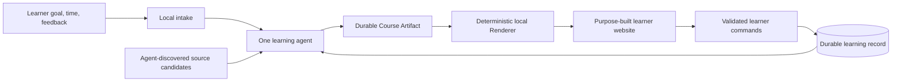
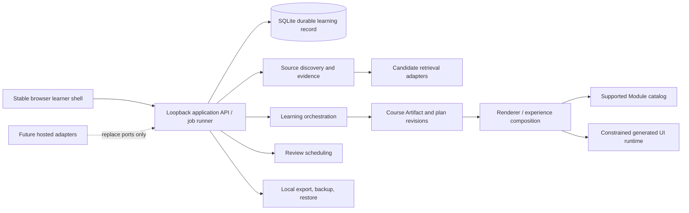

# Solution Document

Status: Proposed

Based on: [accepted Requirements Document](Requirements.md) (accepted at 50252064f91b500efd30bb95cc8ac14724bdf279) and [accepted Discovery Document](Discovery.md) (accepted at 50b86de2c174af4e0ace7866b42e96e9d72535bb)

## Recommendation

Build the local, single-owner product as an evolutionary application with one durable learning record and a stable browser shell. Start with a **Course Artifact → Renderer** deep seam: one learning agent turns an intake and discovered source evidence into an immutable, durable Course Artifact; the local site deterministically renders it; learner work and feedback append to the same record.

Keep the previously proposed target architecture as the destination, not as a build-all-at-once prerequisite: local browser shell, application-owned durable record, agent-driven source discovery and qualification, evidence-driven adaptation and review scheduling, and generated UI that can render immediately only through a constrained runtime. This meets the local V1 while preserving ports for later hosted/multi-user adapters without delivering either.

## Approaches considered

| Approach | Result | Decisive trade-off |
| --- | --- | --- |
| Build the full target architecture before a learner completes a course | Viable, not recommended | Meets target safeguards but delays proof that the agent can create a useful durable journey and freezes boundaries before real variation is known. |
| Walking skeleton with durable Course Artifact → Renderer, evolved behind stable seams | **Recommended** | Gives immediate learner evidence and a deterministic rendering boundary while retaining durable-record and privilege ownership. It requires disciplined artifact/version contracts as capabilities appear. |
| Chat-first or browser-storage prototype | Not viable | Fails the required purpose-built UI, authoritative durable/auditable record, recovery, and credible growth path. |
| Execute generated code in the trusted shell or permit arbitrary agent/tool writes | Not viable | Violates the constrained-UI trust boundary and prevents reliable audit, revocation, and application-owned state transitions. |

## Initial deep seam and walking skeleton

CourseArtifact is the first stable application contract. It is a versioned, immutable description of a course or journey revision: learner goal and available time; ordered lesson/activity specifications; source-evidence references and recorded gaps; read-ahead and daily views; and bounded presentation data. It is not executable browser code and it does not grant an agent a state-write capability.

Renderer.render(courseArtifact, learnerState) deterministically maps that contract to the local learner website. It owns navigation, accessible layout, input validation, and translation of learner actions to application commands. The application, rather than renderer or agent, persists all commands and evidence.

Stage 0 is successful when the learner can supply an intake, receive one source-grounded course, use a rendered lesson, and later reopen the site to see persisted feedback. A source candidate and its use/gap are retained even in this smallest slice; there is no Approved Source list, human source-corpus curation, or H1 approval step. Course planning and UI creation may be one agent initially; split roles only after evidence creates real variation.

## Evolutionary delivery path

The stages are decision gates based on evidence, not a commitment to implement a large stack in advance. Each preserves the preceding contract and record lineage.

| Stage | Add when / why | Capability and durable evidence | Do not add yet |
| --- | --- | --- | --- |
| 0. Walking skeleton | Establish the smallest useful local learning loop. | Intake → one agent → Course Artifact → deterministic Renderer; learner feedback/work persists in SQLite or equivalently durable local record; source candidates, claims/coverage, use and gaps link to the artifact. | Separate planning/UI agents, SRS, module registry, executable generated UI, deployment. |
| 1. Continuity | A second session, course revision, or recovery shows history matters. | Journey identity; immutable course/plan revisions, activity outcomes, preferences, feedback, source retrieval/provenance context, backups/restore and local status. | Inferred multi-user identity or hosted operations. |
| 2. Evidence-driven adaptation | Capability and feedback need to change later work. | Capability Evidence and explainable Adaptation Decisions; algorithmic source qualification/ranking, selection/reuse, weak-source observability, and outcome feedback. | A human source approval gate or claims that a ranking is final/truthful. |
| 3. Reusable learning tools and SRS | Repeated activity shapes and retention needs are demonstrated. | Stable renderer/catalog components, Review Items and deterministic review scheduling; outcomes associated with component and source choices. | Generated code merely to avoid designing a normal renderer component. |
| 4. Generated UI | A documented subject/activity need cannot be served by normal rendering or a stable catalog component. | Generated Module Package, validation, opaque-origin iframe/CSP runtime, finite host capability protocol, incident/denial audit, fallback and revocation. | Ambient network, storage, server, tool, secret, or product-data access; arbitrary dynamic tools. |
| 5. Catalog/productization and mature source optimization | Repeated packages or source patterns have evidence worth operationalizing. | Productization inbox and separately reviewed Supported Module releases; policy-versioned ranking/reuse improvements based on provenance and outcomes. | Automatic promotion or a human gate for ordinary source discovery, qualification, selection, or use. |

The target V1 demonstrations still include Malay plus an additional viable subject, persistent review, adaptation, source auditability, and the generated-UI case. The path only orders discovery and implementation so those capabilities are justified by learning-loop evidence.

## Target application architecture

The browser shell, API/job runner, and SQLite record run in one loopback-local process. A single local owner is supplied by the local adapter, but LearnerId remains part of commands and records so identity/tenancy can later move behind a port. SQLite is the authoritative write owner; browser cache and generated-package cache are rebuildable.

### Application seams

| Seam | Responsibility and contract | Initial boundary |
| --- | --- | --- |
| Course Artifact & Renderer | createRevision, getArtifact, render, submitAction; keeps agent output declarative and rendering deterministic until Stage 4. | Typed artifact schema and shell view model. |
| Journey & Evidence | Validates recordWork, recordCheckIn, revisePlan, and derives capability evidence/adaptation. | Transactional SQLite repositories; agents/packages never write directly. |
| Source Discovery & Evidence | Agents discover candidates; recordCandidate, qualify, rank, selectOrReuse, recordUse, recordGap, explain. | Retrieval adapters plus versioned, inspectable policy inputs; no curated trust snapshot directory. |
| Experience Composition | Resolves stable renderer/catalog capability first; records a catalog gap before requesting generated UI. | Typed intent and layout specification. |
| Generated Module Runtime | Validates, renders, dispatches finite UI capabilities, tears down, and revokes immutable packages. | Browser sandbox adapter, introduced only at Stage 4. |
| Review Scheduling | recordReview, dueFor, reschedule; applies configured spacing policy. | Deterministic policy behind a port. |
| Local Operations | backup, exportBundle, restore, appendAudit, health. | Filesystem plus SQLite; future services replace ports. |

### Source discovery and qualification

The system receives source candidates from agent-driven retrieval, not from an H1-maintained trusted corpus. A SourceRecord retains available provenance, retrieval/version context, permitted-use signals, coverage/claims, category (knowledge/evidence or community/practitioner when useful), and links to artifacts and outcomes. Qualification and ranking consume available quality, trust, relevance, coverage, provenance, permitted-use, prior-use, and outcome signals; the policy version and inputs/rationale are retained with every select/reuse result. A weak or poor source can be used in V1, but its use and observed effects must remain visible. Missing evidence produces a SourceGap, never an unsupported instructional claim.

H1 retains product acceptance and the separate human decision required to productize a repeated UI pattern. H1 is neither a source curator nor an approval gate for normal discovery, qualification, ranking, selection, reuse, or use.

### Generated UI target and trust boundary

At Stage 4, a GeneratedModulePackage is an immutable content-addressed source bundle with a manifest, bounded input/output schemas, declared finite capability set, generator/run/input provenance, validation result, usage/outcome links, and predecessor. The validator verifies hash/contract linkage, capability allowlist, schema bounds, prohibited remote-resource scan, fixture/readiness tests, and layout/style/accessibility checks before first render.

The runtime creates a fresh sandbox="allow-scripts" iframe without allow-same-origin, forms, popups, downloads, or navigation permissions, with deny-by-default CSP (default-src 'none' and connect-src 'none'). It communicates only through a nonce-bound, versioned MessageChannel. The host validates source, package manifest, session/activity binding, schemas, payload/event limits, and each request before acting.

The initial protocol can only accept activity.submit, bounded transient activity.draft, allowlisted telemetry.emit, clamped layout.requestResize, and ui.reportError. Unknown, malformed, stale, over-limit, or undeclared requests are denied and audited. No package has network, cookies/storage, host DOM, product record, application API, server, tool, secret, or general learner-data authority. Failed validation or runtime incidents tear down the package, retain evidence, and use a stable fallback. Revocation disables its hash for future renders; promotion remains a separately reviewed Supported Module release.

## Records and operations

Every application write appends or transactionally associates an audit event. Core records are Journey, CourseArtifact, PlanRevision, LearningActivity, CapabilityEvidence, AdaptationDecision, ReviewItem, SourceRecord, SourceQualification, SourceSelection, SourceGap, and ArtifactLineage; after Stage 4 they also include GeneratedModulePackage, PackageValidationResult, GeneratedModuleUse, and PackageRevocation.

Local operations provide documented setup, migration, backup, export, restore, health/status, and recovery. Exports include only source artifacts that may be retained/exported under their terms; they redact learner responses by default and must not imply public release of learner, model, or discovered-source data. Before public release, H1 must select a license and the project must document contribution/governance, dependency/generated-artifact notices, data exclusions, and a private vulnerability-reporting route. This is a release gate, not a V1 architecture blocker.

## Risks, constraints, and Wayfinder candidates

| Item | Current treatment / next decision |
| --- | --- |
| Pedagogical calibration and effectiveness claims | Retain evidence/policy versions and validate Malay plus another subject; seek pedagogy/subject specialist input before broad claims. |
| Source ranking can amplify poor evidence | Preserve signals, policy versions, selection and outcomes; test a weak/poor-source case. Tune thresholds and algorithms only with observed evidence. |
| Generated package escape or breakage | Do not introduce it until normal rendering demonstrably fails; then use the sandbox/protocol/fallback/revocation boundary. Any richer privilege needs a later human-owned security decision. |
| Productization criteria | Surface repeated usefulness and failures; H1 decides promotion criteria and each release, without becoming a source-use gate. |
| Future hosted/multi-user mode | Before promotion beyond local V1, decide identity/roles, privacy, retention/consent, tenancy, secrets, server isolation, monitoring, operations, and migration. |
| Open-source license | Human-owned choice before public release; no license is selected here. |

## Architecture decisions recorded

- [ADR 0001: local application process and SQLite record](../adr/0001-local-application-process-and-sqlite.md)
- [ADR 0002: immediate generated module runtime and productization boundary](../adr/0002-catalog-candidate-and-productization-boundaries.md)
- [ADR 0003: application-owned state and provenance](../adr/0003-application-owned-state-and-provenance.md)
- [ADR 0004: Course Artifact to Renderer evolutionary seam](../adr/0004-course-artifact-renderer-evolutionary-seam.md)

## Human decision requested

Accept this evolutionary local-first solution: begin with the Course Artifact → Renderer walking skeleton, evolve by evidence through continuity, adaptation, SRS/reusable tools, and only then generated UI where normal rendering is insufficient, while preserving the stated target architecture and its constrained trust boundary.
