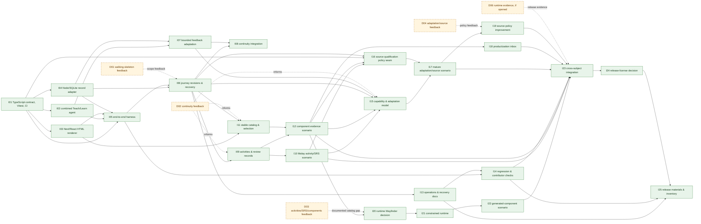

# Work Execution Plan

Status: Accepted

Accepted: 2026-07-26

Based on: [accepted Requirements Document](Requirements.md) (accepted at `50252064f91b500efd30bb95cc8ac14724bdf279`) and [accepted Solution Document](Solution.md) (accepted at `c92582dfd246d6d6bfc1a244865da3b543f8aeb0`)

## Delivery Strategy

Build a TypeScript-first, contract-first walking skeleton. `I01` establishes the
standard TypeScript workspace: the versioned `CourseArtifact` JSON Schema,
TypeScript types and validator, Vitest fixtures, and pull-request typecheck/test
CI. It is the single shared interface PR. Once it lands, the combined Teach/Learn
course agent, deterministic Next/React renderer, local Node/SQLite record adapter,
and end-to-end harness can proceed as independently reviewable PRs in parallel.
Their integration creates the first learner journey; demonstrations inform later
scope but do not impose artificial serialization.

The delivery path remains evolutionary. Stage 0 proves a combined agent can create
a source-grounded course and clean declarative HTML pages, rendered by trusted
React components, with feedback/work captured through validated learner commands.
Stage 1 earns continuity. Stage 2 adds practical activities, deterministic SRS, and
stable component selection/reuse. Only after those experiences generate useful
signals do mature capability adaptation and algorithmic source policy arrive.
Productization observes patterns without automatic promotion. The executable
generated-component runtime is a separate, late Wayfinder that needs both an
observed HTML/catalog gap and `h1`'s affirmative decision.

`I02` includes a deliberate Teach-skill compatibility seam: it maps the useful
workflow concepts (mission/context, resource research, learning records, lesson
HTML, and reusable assets) to application-owned records and `HtmlPageSpec`. The
skill is an inspiration and evaluation reference, never a runtime dependency or a
workspace-file persistence model.

## Project

| Field | Value |
| --- | --- |
| ID | `openbook-local-first` |
| Title | Local-first adaptive learning V1 |
| State | Open |
| Contextual Definition of Done | Malay and at least one additional viable subject demonstrate a durable, source-grounded adaptive local journey, persistent review, auditable source/adaptation decisions, and a generated-UI case only through its constrained boundary. Local operation and releasable open-source materials meet the accepted Requirements. |
| Evidence | The accepted Requirements and Solution, plus the ordered demonstrations below. |

## Delivery Team

| ID | Member | Type | Responsibility |
| --- | --- | --- | --- |
| `h1` | Luke Lemke | Human | Sole Work Unit Owner; product intent, priority, acceptance, and Wayfinder decisions. |
| `a1` | AI delivery team | Agent | PR-sized implementation, tests, docs, and proposed evidence; no human or policy authority. |

## Derived Work Graph View

Markdown tables below are authoritative. Solid arrows are hard implementation or
interface dependencies. Dashed arrows are demonstration/Wayfinder feedback: they
can change later scope, but feedback alone never blocks a safe, otherwise-ready PR.

## Flat Work Units

All Units are `Open`, owned by `h1`, and are ready when their listed hard
dependencies are `Done`. Every Agent Item is owned by `a1`; Human Items are owned
by `h1`. Demonstration metadata is evidence and feedback, not a dependency unless
explicitly named in an Item.

### U01 — Contract-first HTML learning loop

| Field | Value |
| --- | --- |
| Project / human owner / state | `openbook-local-first` / `h1` / Open |
| Dependencies | None |
| Demonstration IDs / evidence | `D01`; intake, source candidates/use/gaps, clean course/lesson pages, feedback/work, restart, and auditable lineage. |
| Contextual Definition of Done | A versioned TypeScript Course Artifact contract and fixture suite permit independent agent, renderer, persistence, and harness PRs; application-owned writes prevent agents/pages from directly mutating records. |

| Work Item | Kind / owner / state | Dependencies | Contextual Definition of Done and evidence |
| --- | --- | --- | --- |
| `I01` TypeScript Course Artifact contract, fixtures, and baseline checks | Agent / `a1` / Open | None | Establish the Next/TypeScript workspace shape needed by the contract packages; versioned Course Artifact and learner-command JSON Schemas, TS types, public validator, `HtmlPageSpec`, source candidate/use/gap, work, feedback, and lineage fixtures pass Vitest. A learner command is a validated intent across the React page/application boundary (for example start/resume, submit work, or give feedback), not a direct persistence instruction; invalid or unknown commands cannot write. GitHub Actions runs `typecheck` and Vitest on pull requests. |
| `I02` Combined Teach/Learn course agent | Agent / `a1` / Open | `I01` | One Node-side application agent turns intake and discovered evidence into a source-grounded course; gaps precede unsupported claims. Document/test the Teach-skill mapping seam: mission/context → journey goal, resources → source candidate/use/gap, learning record → learner state, lesson HTML → declarative `HtmlPageSpec`, and assets → later catalog input. |
| `I03` Deterministic Next/React HTML renderer | Agent / `a1` / Open | `I01` | The local Next.js Node-runtime application deterministically renders accessible course/lesson React/HTML from fixtures, applies trusted layout/style rules, and translates learner interaction into validated commands. It does not execute generated scripts or accept raw privileged HTML. |
| `I04` Local Node/SQLite record and feedback adapter | Agent / `a1` / Open | `I01` | TypeScript core ports and a transactional local SQLite adapter retain artifact lineage, feedback, work, and source evidence across restart. Next route/server adapters are callers, never the direct durable-state owner. |
| `I05` End-to-end demo/test harness | Agent / `a1` / Open | `I01`, `I02`, `I03`, `I04` | Standard TypeScript integration tests exercise a repeatable local scenario: intake, agent artifact, rendered pages, work/feedback command, restart, and source lineage. |

### U02 — Integrated continuity journey

| Field | Value |
| --- | --- |
| Project / human owner / state | `openbook-local-first` / `h1` / Open |
| Dependencies | `I02`, `I03`, `I04`, `I05` |
| Demonstration IDs / evidence | `D01`, `D02`; a learner resumes a revision with visible records and a bounded feedback/work-driven next-step change. |
| Contextual Definition of Done | Journey identity, immutable plan revisions, recoverable local state, and an explainable bounded next-lesson, pacing, or plan revision work without claiming mature calibration/ranking. |

| Work Item | Kind / owner / state | Dependencies | Contextual Definition of Done and evidence |
| --- | --- | --- | --- |
| `I06` Journey revisions and recovery | Agent / `a1` / Open | `I04`, `I05` | Migration-safe TypeScript repositories, immutable revisions, preferences, outcomes, backup/restore, and recovery checks preserve local journey context. |
| `I07` Bounded feedback adaptation | Agent / `a1` / Open | `I02`, `I04` | Feedback/work creates a durable, explained next-step, pacing, or plan revision without a mature capability-evidence engine. |
| `I08` Continuity integration scenario | Agent / `a1` / Open | `I06`, `I07` | Next application restart/recovery and feedback-driven revision evidence are reproducible through the normal test stack. |

### U03 — Practical learning, SRS, and stable components

| Field | Value |
| --- | --- |
| Project / human owner / state | `openbook-local-first` / `h1` / Open |
| Dependencies | `U02` |
| Demonstration IDs / evidence | `D03`; practical activity, deterministic review, stable-component selection/reuse, and catalog gaps are visible. |
| Contextual Definition of Done | Activity and Review Item primitives persist outcomes and deterministic review; declarative presentation intent selects stable React components and records usage, reuse, outcomes, feedback, and catalog gaps. No executable generated code is used. |

| Work Item | Kind / owner / state | Dependencies | Contextual Definition of Done and evidence |
| --- | --- | --- | --- |
| `I09` Activity and review records | Agent / `a1` / Open | `I06` | Activity outcomes and deterministic `dueFor`/`reschedule` behavior persist across restart. |
| `I10` Malay activity/SRS scenario | Agent / `a1` / Open | `I09` | A practical Malay activity and vocabulary review produce visible evidence and a subsequent learning input. |
| `I11` Stable catalog and selection | Agent / `a1` / Open | `I03`, `I06` | A typed stable React component catalog and declarative layout selection retain gap/reuse evidence. |
| `I12` Component evidence scenario | Agent / `a1` / Open | `I09`, `I11` | An activity/review renders with selected stable components and retains usage/outcome/feedback and catalog-gap evidence. |

### U04 — Operations and quality checks

| Field | Value |
| --- | --- |
| Project / human owner / state | `openbook-local-first` / `h1` / Open |
| Dependencies | `U02` |
| Demonstration IDs / evidence | `D02`, `D07`; clean setup, health, backup/restore, and contributor checks. |
| Contextual Definition of Done | Local Next/Node setup, operation, health, migration/recovery, known limitations, and automated TypeScript checks are documented and exercised alongside the product. |

| Work Item | Kind / owner / state | Dependencies | Contextual Definition of Done and evidence |
| --- | --- | --- | --- |
| `I13` Operations and recovery docs | Agent / `a1` / Open | `I06` | Setup, Node runtime expectations, health, backup/restore, recovery, and data-boundary guidance are runnable locally. |
| `I14` Regression and contributor checks | Agent / `a1` / Open | `I05`, `I13` | Vitest fixtures/integration, restart/recovery, typecheck, CI, and contribution checks run from documented setup. |

### U05 — Mature adaptation and source policy

| Field | Value |
| --- | --- |
| Project / human owner / state | `openbook-local-first` / `h1` / Open |
| Dependencies | `U02`, `U03` |
| Demonstration IDs / evidence | `D04`; capability-driven adaptation, an auditable source decision, observable weak/poor-source effect, and a source gap. |
| Contextual Definition of Done | Capability Evidence, explainable Adaptation Decisions, and policy-versioned source qualification/ranking/selection/reuse retain required signals and audits without a curated corpus or H1 source-use gate. |

| Work Item | Kind / owner / state | Dependencies | Contextual Definition of Done and evidence |
| --- | --- | --- | --- |
| `I15` Capability and adaptation model | Agent / `a1` / Open | `I06`, `I07`, `I10`, `I12` | Proportionate evidence changes plan, pacing, difficulty, review, or teaching with auditable rationale after practical learning and stable-component evidence exist. |
| `I16` Source qualification policy seam | Agent / `a1` / Open | `I01`, `I06`, `I10`, `I12` | Versioned qualification/ranking/selection/reuse captures available quality, trust, relevance, coverage, provenance, permitted-use, prior-use, and outcome signals after core experience evidence exists. |
| `I17` Mature adaptation/source scenario | Agent / `a1` / Open | `I15`, `I16` | A source gap and weak/poor-source effect remain observable with a traceable adaptation and source decision. |

### U06 — Productization and source improvement

| Field | Value |
| --- | --- |
| Project / human owner / state | `openbook-local-first` / `h1` / Open |
| Dependencies | `U03`, `U05` |
| Demonstration IDs / evidence | `D04`, `D05`; repeated component/source patterns and their outcome evidence are inspectable. |
| Contextual Definition of Done | A productization inbox surfaces repeated useful and failing patterns; supported-module releases remain separately reviewed and source-policy improvement remains algorithmic rather than a human source-use gate. |

| Work Item | Kind / owner / state | Dependencies | Contextual Definition of Done and evidence |
| --- | --- | --- | --- |
| `I18` Component productization inbox | Agent / `a1` / Open | `I12` | Component specifications, generation/selection provenance, validation, usage, outcomes, and feedback identify candidates without automatic promotion. |
| `I19` Source-policy improvement loop | Agent / `a1` / Open | `I17` | Outcome-informed policy revisions retain policy version and decision lineage; ordinary source use remains agent/algorithm driven. |

### U07 — Evidence-gated generated-component runtime

| Field | Value |
| --- | --- |
| Project / human owner / state | `openbook-local-first` / `h1` / Open |
| Dependencies | `U03` |
| Demonstration IDs / evidence | `D06`, only if opened; documented catalog gap, denial audit, fallback, and revocation. |
| Contextual Definition of Done | Only after an affirmative H1 Wayfinder decision based on a documented HTML/catalog gap, a validated immutable Generated Module Package renders through the constrained opaque-origin iframe/CSP runtime with finite host capabilities, audit, fallback, and revocation. |

| Work Item | Kind / owner / state | Dependencies | Contextual Definition of Done and evidence |
| --- | --- | --- | --- |
| `I20` Generated-runtime Wayfinder decision | Human / `h1` / Open | `I12` | Record whether observed insufficiency justifies the bounded runtime; no decision leaves declarative HTML and stable React components as the route. |
| `I21` Package validator and constrained runtime | Agent / `a1` / Open | `I20` | Hash/contract/capability validation, CSP/sandbox/MessageChannel boundary, denial audit, fallback, and revocation pass boundary tests. |
| `I22` Generated-component evidence scenario | Agent / `a1` / Open | `I21` | A documented-gap component shows constrained rendering, provenance, usage/outcome/feedback, denied request, fallback, and revocation. |

### U08 — Final integration and release readiness

| Field | Value |
| --- | --- |
| Project / human owner / state | `openbook-local-first` / `h1` / Open |
| Dependencies | `U03`, `U04`, `U05`, `U06`; `U07` only if its Wayfinder opens |
| Demonstration IDs / evidence | `D05`, `D07`; additional viable subject, generic seams, final source/adaptation evidence, and releasable local operations. |
| Contextual Definition of Done | Malay and another viable subject demonstrate generic capability. Contributor operations, governance, private vulnerability disclosure, data exclusions, selected license, and releasable provenance/notices are complete before public release. |

| Work Item | Kind / owner / state | Dependencies | Contextual Definition of Done and evidence |
| --- | --- | --- | --- |
| `I23` Cross-subject final integration | Agent / `a1` / Open | `I10`, `I12`, `I14`, `I17`, `I18`, `I19`; `I22` if opened | An additional viable subject uses generic seams and preserves source/adaptation and learning evidence. |
| `I24` Release-license decision | Human / `h1` / Open | `I23` | Select and record a license; confirm protected data remains excluded. |
| `I25` Release materials and inventory | Agent / `a1` / Open | `I13`, `I14`, `I24` | Contributor/governance/security-disclosure docs and dependency/generated-artifact notices/terms are verified. |

## Demo Story

| Order | Demonstration | Participating Units | Observable evidence and reviewers | Feedback consequence |
| --- | --- | --- | --- | --- |
| 1 | `D01` Walking skeleton | `U01`, `U02` | `h1` observes intake, source-grounded clean Next/React course/lesson pages, feedback/work commands, restart, and source lineage. | Changes U01/U02 implementation scope; it does not block already-defined integration dependencies. |
| 2 | `D02` Continuity | `U02`, `U04` | `h1` observes revision history, restart/backup/restore, and a bounded feedback/work-driven next-step change. | Informs experience investment; it is feedback, not a hard dependency. |
| 3 | `D03` Activities, SRS, and stable components | `U03` | `h1` observes practical work, persistent review, component reuse, and catalog-gap evidence. | An evidenced insufficiency may justify `I20`; otherwise declarative HTML/catalog remains sufficient. |
| 4 | `D04` Mature adaptation and source policy | `U05`, `U06` | `h1` observes capability-driven changes, source-decision audit trail, weak/poor-source effect, a gap, and policy lineage. | Revises calibration or policy; never creates an H1 source-use gate. |
| 5 | `D05` Generic cross-subject integration | `U03`, `U05`, `U06`, `U08` | `h1` observes an additional viable subject using generic seams and auditable outcomes. | May change final integration scope and release readiness. |
| 6 | `D06` Generated component, if justified | `U07` | Only if opened, `h1` reviews bounded capability, denial, provenance, fallback, and revocation evidence. | Security concern prevents richer privilege; no decision leaves the normal route in place. |
| 7 | `D07` Local/open-source readiness | `U04`, `U08` | `h1` or a contributor follows clean setup/check/recovery/contribution guidance and reviews release inventory. | License, data, notice, or disclosure gaps revise U08; no release occurs until resolved. |

## Human decision

Accepted by Luke Lemke on 2026-07-26. This TypeScript/Next.js Work Execution Plan
supersedes the previous Python-oriented plan, preserves the target architecture and
evolutionary delivery order, and authorizes a new tracker synchronization preview.
